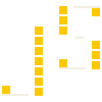

<p align="center">
  
</p>

# JumpStack

**Agent-optimized, fully loaded TanStack.**

JumpStack is full-stack starter optimized for AI agents, build with Tanstack ecosystem plus auth, database, type-safe APIs, and testing — all preconfigured. Jump right in and start shipping.

## What's Included

| Layer         | Technology                                                                      | Purpose                                          |
| ------------- | ------------------------------------------------------------------------------- | ------------------------------------------------ |
| Framework     | [TanStack Start](https://tanstack.com/start)                                    | SSR React meta-framework (Vite-based)            |
| Routing       | [TanStack Router](https://tanstack.com/router)                                  | File-based, type-safe routing with loaders       |
| Data fetching | [TanStack Query](https://tanstack.com/query) + [oRPC](https://orpc.dev)         | Isomorphic RPC with caching and SSR prefetch     |
| Database      | [Drizzle ORM](https://orm.drizzle.team) + PostgreSQL                            | Type-safe SQL with push-based migrations         |
| Auth          | [better-auth](https://www.better-auth.com)                                      | Email/password + social login (Google, Facebook) |
| Styling       | [Tailwind CSS v4](https://tailwindcss.com) + [shadcn/ui](https://ui.shadcn.com) | Utility-first CSS with accessible components     |
| Forms         | [TanStack Form](https://tanstack.com/form)                                      | Type-safe form state with Zod validation         |
| Testing       | [Vitest](https://vitest.dev) + [Playwright](https://playwright.dev)             | Unit tests and end-to-end tests                  |

## Agent-Optimized Testing

Testing is deeply integrated into JumpStack to optimize AI agent workflows. Agents can run and validate tests as part of their development loop.

**Playwright Test Agents:**

JumpStack using [Playwright Test Agents](https://playwright.dev/docs/test-agents) but customized for better test output. This enables AI agents to generate, run, and heal end-to-end tests autonomously.

**Agent Workflow with Superpowers**

It's recommended to also uses [Superpowers](https://github.com/obra/superpowers) to optimize AI agent workflows. Superpowers provides structured skills for brainstorming, test-driven development, planning, debugging, and code review — ensuring agents follow disciplined processes instead of ad-hoc coding.

## Prerequisites

- **Node.js** >= 20
- **pnpm** (package manager)
- **PostgreSQL** (local or remote)
- **Docker** — Required for [Testcontainers](https://testcontainers.com) (spins up PostgreSQL for integration tests)
- **Playwright CLI** — Install browsers with `pnpm exec playwright install`

## Quick Start

```bash
# Clone the repository
git clone <your-repo-url>
cd jumpstack

# Install dependencies
pnpm install

# Set up environment variables
cp .env.example .env.local
# Edit .env.local with your DATABASE_URL and BETTER_AUTH_SECRET

# Generate BETTER_AUTH_SECRET
pnpm dlx @better-auth/cli secret

# Push schema to database
pnpm db:push

# Start dev server
pnpm dev
```

The app will be available at `http://localhost:3000`.

## Environment Variables

| Variable               | Required | Description                                                                            |
| ---------------------- | -------- | -------------------------------------------------------------------------------------- |
| `DATABASE_URL`         | Yes      | PostgreSQL connection string                                                           |
| `BETTER_AUTH_SECRET`   | Yes      | Secret key for auth session signing (generate with `pnpm dlx @better-auth/cli secret`) |
| `BETTER_AUTH_URL`      | No       | Override base URL for auth (defaults to request origin)                                |
| `GOOGLE_CLIENT_ID`     | No       | Google OAuth client ID                                                                 |
| `GOOGLE_CLIENT_SECRET` | No       | Google OAuth client secret                                                             |

## Customizing the Design System

The default design system is built on [shadcn/ui](https://ui.shadcn.com). To customize it:

1. Go to [shadcn/ui Theme Creator](https://ui.shadcn.com/create) and generate a theme that matches your brand
2. Replace the current styles in `src/styles.css` with the generated theme variables

## Project Structure

```txt
src/
  routes/                    # File-based routes (TanStack Router)
    __root.tsx               # Root layout: nav, providers, devtools
    index.tsx                # Home page
    signin.tsx               # Sign in (email + social)
    signup.tsx               # Sign up (email + social)
    posts.tsx                # Posts list + populate
    todos.tsx                # Todo CRUD with TanStack Form
    _authed.tsx              # Auth layout guard (redirects to /signin)
    _authed/user.tsx         # User profile (protected)
    api/
      rpc/$.ts               # oRPC HTTP handler (catch-all)
      auth/$.ts              # better-auth HTTP handler (catch-all)

  orpc/                      # Type-safe API layer
    client.ts                # Isomorphic oRPC client + TanStack Query utils
    base.ts                  # Procedure bases (pub, authed) + auth middleware
    errors.ts                # ORPCError factories + message registry
    query-options.ts         # Shared query options (reusable across routes)
    apis/
      index.ts               # Router assembly (nested by domain)
      todos.ts               # Todo CRUD procedures
      posts.ts               # Post list + populate procedures
      user.ts                # User profile procedure (authed)

  db/
    index.ts                 # Drizzle client
    schema.ts                # App tables (todos, posts)
    auth-schema.ts           # better-auth tables

  lib/
    auth.ts                  # better-auth server config
    auth-client.ts           # better-auth React client
    utils.ts                 # Shared utilities (cn, etc.)

  integrations/
    tanstack-query/
      root-provider.tsx      # QueryClient setup + global error toasts
      devtools.tsx           # TanStack Query devtools

  components/
    ui/                      # shadcn/ui primitives
    suspense-query-boundary.tsx  # Reusable Suspense + error boundary
    not-found.tsx            # Not found page
    global-error.tsx         # Global error boundary

  env.ts                     # T3Env environment variable validation
  styles.css                 # Global styles + Tailwind theme
  router.tsx                 # Router factory with SSR query integration
```

## Common Tasks → Files to Modify

| Task                    | Files                                                         |
| ----------------------- | ------------------------------------------------------------- |
| Add a new API procedure | `src/orpc/apis/<domain>.ts`, `src/orpc/apis/index.ts`         |
| Add a new page          | `src/routes/<path>.tsx`                                       |
| Add a protected page    | `src/routes/_authed/<path>.tsx`                               |
| Add a DB table          | `src/db/schema.ts`, then `pnpm db:push`                       |
| Add an error message    | `src/orpc/errors.ts` (`ERROR_MESSAGES`)                       |
| Add a UI component      | `src/components/ui/` (shadcn) or `src/components/`            |
| Change auth config      | `src/lib/auth.ts` (server), `src/lib/auth-client.ts` (client) |
| Add env variables       | `src/env.ts`                                                  |

## Conventions

### Path alias

`#/*` maps to `src/*` (configured in tsconfig + `package.json` imports field).

### Naming

- Route files: match URL path (`signin.tsx`, `_authed/user.tsx`)
- oRPC API files: plural domain name (`todos.ts`, `posts.ts`)
- Procedure exports: verb-based (`list`, `add`, `remove`, `toggle`, `populate`)

### oRPC patterns

- **Procedure bases**: Use `pub` (public) or `authed` (authenticated) from `#/orpc/base` — never import `os` directly
- **Error throwing**: Always use factory functions (`notFound`, `badRequest`, `unauthorized`) from `#/orpc/errors` — never throw plain `Error`
- **Error messages**: Register in `ERROR_MESSAGES` map in `errors.ts` with dot-namespaced keys (`"feature.error_kind"`)
- **Router assembly**: One file per domain in `src/orpc/apis/`, assembled in `apis/index.ts`

### Query patterns

- Define query options at module level: `const listOptions = orpc.<domain>.<proc>.queryOptions()`
- Share query options across routes via `src/orpc/query-options.ts`
- SSR prefetch in `loader`: `await context.queryClient.ensureQueryData(queryOptions)`
- Client queries: `useSuspenseQuery(queryOptions)` inside components
- Client mutations: `useMutation` with `onSuccess` invalidating related query keys
- Streaming (non-blocking): omit `await` in loader, wrap data component in `<SuspenseQueryBoundary>`

### Auth

- **Route guards**: `beforeLoad` in layout routes (e.g. `_authed.tsx`) — use `redirect()` for unauthenticated users
- **Procedure auth**: `authed` base runs auth middleware per API call — provides `context.user` and `context.session`
- Two mechanisms are independent: route guards control navigation, procedure auth controls data access

### Environment variables

- Validated via T3Env in `src/env.ts` — add new vars there first
- Server vars are plain names, client vars require `VITE_` prefix

## Detailed Documentation ⚠️

- [`docs/architecture.md`](docs/architecture.md) — Full architecture guide: request lifecycles, system diagram, development patterns
- [`docs/orpc.md`](docs/orpc.md) — oRPC conventions: error handling, middleware, context flow, router organization
- [`docs/testing.md`](docs/testing.md) — Testing setup: Vitest config, Testcontainers, Playwright patterns

## Dev Commands

| Command            | Description                       |
| ------------------ | --------------------------------- |
| `pnpm dev`         | Start dev server (port 3000)      |
| `pnpm build`       | Production build                  |
| `pnpm preview`     | Preview production build          |
| `pnpm test`        | Run unit tests (Vitest)           |
| `pnpm test:watch`  | Run unit tests in watch mode      |
| `pnpm test:e2e`    | Run end-to-end tests (Playwright) |
| `pnpm test:all`    | Run all tests                     |
| `pnpm lint`        | Lint with ESLint                  |
| `pnpm format`      | Check formatting with Prettier    |
| `pnpm check`       | Auto-fix formatting + lint        |
| `pnpm db:push`     | Push schema to database           |
| `pnpm db:generate` | Generate Drizzle migrations       |
| `pnpm db:migrate`  | Run Drizzle migrations            |
| `pnpm db:studio`   | Open Drizzle Studio               |
